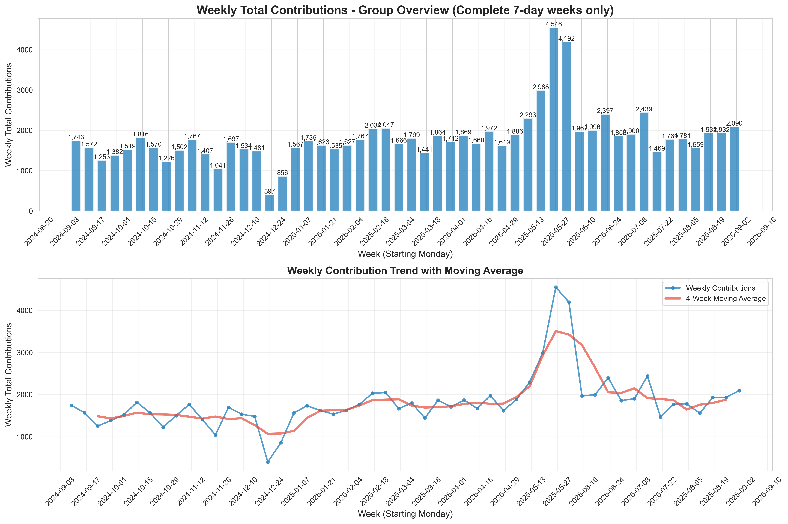

# GitHub Users Analysis Tools

This project contains a comprehensive toolset for retrieving GitHub users/organization members and analyzing their contribution data.

## 📁 File Structure

**Main Tools:**
- `github_users_enhanced.py` - User/Organization search
- `github_batch_analyzer.py` - Batch contribution analysis  
- `github_group_trends.py` - Weekly group trend analysis ⭐**Recommended**

**Support Tools:**
- `github_users_gh.py` - Basic user search
- `github_visualizer.py` - Comprehensive chart generation
- `github_contributions.py` - Individual user contribution analysis

**Configuration Files:**
- `requirements.txt` - Python dependencies
- `README.md` - Usage instructions (English)
- `README_ja.md` - Usage instructions (Japanese)

## Scripts

### 1. User Search (`github_users_enhanced.py`) - **Recommended**

Uses GitHub API via gh command with support for multiple retrieval modes.

**Features:**
- Supports keyword search, organization all members, and public members retrieval
- Flexible configuration via command line arguments
- Reliable and fast using official API
- Requires gh CLI authentication

**Usage:**
```bash
# Authenticate with GitHub CLI (first time only)
gh auth login

# Keyword search
python3 github_users_enhanced.py --mode search -q "YourCompany"

# Get all organization members (requires permissions)
python3 github_users_enhanced.py --mode org -q "your-org"

# Get organization public members
python3 github_users_enhanced.py --mode org-public -q "your-org"

# Specify output file
python3 github_users_enhanced.py --mode search -q "keyword" -o my_results.json
```

### 2. Basic Version (`github_users_gh.py`)

Uses GitHub API via gh command (keyword search only).

**Usage:**
```bash
python3 github_users_gh.py
```

## Setup

### Install Dependencies

```bash
# Create virtual environment
python3 -m venv venv

# Activate virtual environment
source venv/bin/activate

# Install required packages
pip install -r requirements.txt
```

### GitHub CLI

1. Install GitHub CLI:
   ```bash
   brew install gh  # macOS
   ```

2. Authenticate:
   ```bash
   gh auth login
   ```

## Output

Scripts output JSON files in the following format:

### Output Example:
```json
[
  {
    "login": "example-org",
    "id": 12345,
    "avatar_url": "https://avatars.githubusercontent.com/u/12345?v=4",
    "html_url": "https://github.com/example-org",
    "type": "Organization",
    "score": 1.0
  }
]
```

### 3. Batch Analysis (`github_batch_analyzer.py`) - **New Feature**

Batch retrieves and analyzes contribution data from multiple users.

**Features:**
- Parallel retrieval of contributions from user search results
- Calculates daily/monthly aggregate statistics
- Extracts top contributors
- Generates data for visualization

**Usage:**
```bash
# Analyze contributions from all users in file
python3 github_batch_analyzer.py -f github_users_search_YourCompany.json

# Test run with limited users
python3 github_batch_analyzer.py -f github_users_search_YourCompany.json --limit 10

# Summary only
python3 github_batch_analyzer.py -f github_users_search_YourCompany.json --summary-only
```

### 4. Chart Generation (`github_visualizer.py`) - **New Feature**

Visualizes batch analysis results.

**Features:**
- Daily/monthly contribution trend charts
- User comparison charts
- Contribution breakdown (stacked bar chart)
- Top user trend comparison

**Usage:**
```bash
# Generate all chart types
python3 github_visualizer.py -f batch_analysis_visualization_data.json

# Generate specific chart only
python3 github_visualizer.py -f batch_analysis_visualization_data.json --chart-type daily
```

### 5. Weekly Trend Analysis (`github_group_trends.py`) - **Recommended**

Specialized analysis tool focused on weekly contribution trends for the entire group.

**Features:**
- Analyzes only complete 7-day weeks, excluding incomplete weeks
- Weekly trends + 4-week moving average
- Visualizes group-wide contribution increase/decrease patterns

**Usage:**
```bash
# Generate weekly group trend chart
python3 github_group_trends.py -f batch_analysis_visualization_data.json
```

## Sample Output

### Weekly Group Trends Analysis



*Sample weekly contribution trends showing group activity patterns over time with 4-week moving average*

### User Comparison Analysis


*Top contributors comparison showing individual contribution levels (Sample: GitHub employees)*

### Monthly Group Activity


*Monthly contribution trends for the entire group over time (Sample: GitHub employees)*

## Complete Workflow

```bash
# 1. User search
python3 github_users_enhanced.py --mode search -q "YourCompany"

# 2. Batch contribution analysis
python3 github_batch_analyzer.py -f github_users_search_YourCompany.json

# 3. Chart generation
python3 github_visualizer.py -f batch_analysis_visualization_data.json

# 4. Weekly trend chart (recommended)
python3 github_group_trends.py -f batch_analysis_visualization_data.json
```

## Generated Files

**Data Files:**
- `*_full_analysis.json`: Complete analysis data
- `*_summary.json`: Summary report
- `*_visualization_data.json`: Chart data

**Chart Files:**
- `*_daily_contributions.png`: Daily aggregate trends
- `*_monthly_contributions.png`: Monthly aggregate
- `*_user_comparison.png`: User comparison
- `*_contribution_breakdown.png`: Contribution breakdown
- `*_weekly_group_trends.png`: Weekly group trends (recommended)

## Recommendations

- **GitHub CLI authentication required**: All tools require gh CLI authentication
- **Weekly trend analysis recommended**: `github_group_trends.py` is optimal for understanding group-wide trends
- Use appropriate intervals when sending large numbers of requests
- Adjust `--max-workers` in batch processing to avoid rate limits

## Language Support

- **English**: `README.md`
- **Japanese**: `README_ja.md`